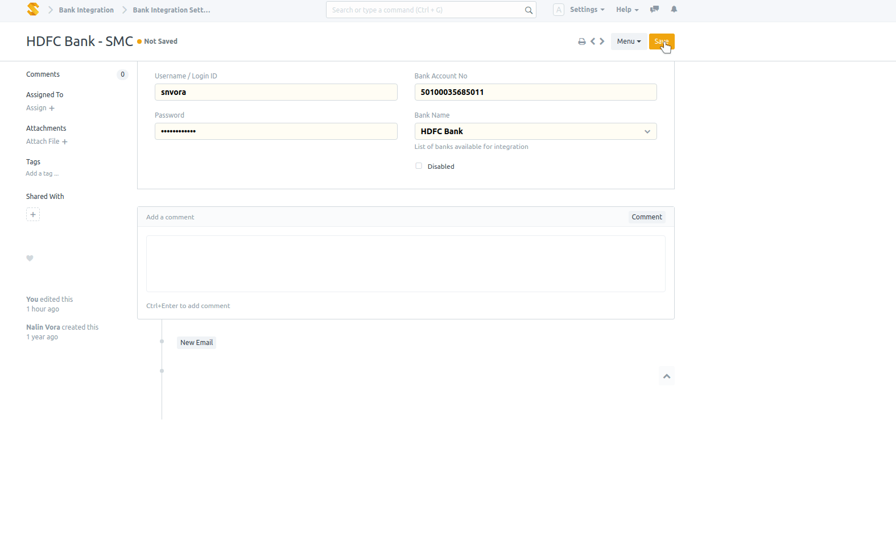

## Bank Integration

Unofficial API to handle bank transactions using ERPNext (v11+)

## Prerequisites

Needs [`chromedriver`](https://launchpad.net/ubuntu/bionic/+package/chromium-chromedriver) installed.

#### In action

#### License

MIT