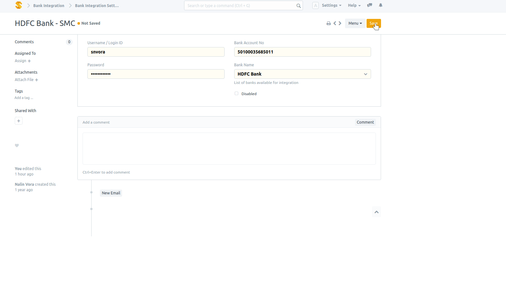

## Bank Integration

Unofficial API to handle bank transactions using ERPNext (v11+)

## Prerequisites

Needs [`chromedriver`](https://launchpad.net/ubuntu/bionic/+package/chromium-chromedriver) installed.

## How It Works

Bank Integration automates interaction with a bank's netbanking website using a headless Chrome browser (via Selenium). It is an ERPNext Frappe app that adds bank-sync and payment capabilities on top of ERPNext's existing accounting features.

### Architecture Overview

```
ERPNext UI  ──►  Frappe whitelisted API  ──►  BankAPI (Selenium / Chrome)  ──►  Bank Netbanking Website
    ▲                                                                                        │
    └────────────────────  Frappe Realtime (Socket.IO) events  ◄────────────────────────────┘
```

There are three main user-facing workflows:

| Workflow | Triggered from | Server-side entry point |
|---|---|---|
| Verify credentials | Bank Integration Settings form save | `BankIntegrationSettings.check_credentials` |
| Sync transactions | Bank Reconciliation page → "Sync Transactions" button | `transactions.get_transactions` |
| Make payment | Payment Entry form → "Make Payment Now" button | `payments.make_payment` |

### Key Components

| File | Purpose |
|---|---|
| `api/bank_api.py` | Base `BankAPI` class – browser setup, Selenium helpers, session caching, realtime messaging |
| `api/hdfc_bank_api.py` | `HDFCBankAPI` subclass – all HDFC-specific navigation, login, OTP/security-questions handling, payment flow, and transaction fetching |
| `api/__init__.py` | `get_bank_api()` factory that maps bank names to their API class; whitelisted helpers for OTP/answer continuation |
| `api/transactions.py` | Whitelisted `get_transactions()` entry point called by the UI |
| `api/payments.py` | Whitelisted `make_payment()` entry point called by the UI |
| `api/auto_reconcile.py` | Whitelisted `reconcile_transactions()` that matches Bank Transactions to Payment Entries / Journal Entries |
| `public/js/common.js` | Front-end helpers – `bi.listenForOtp`, `bi.listenForQuestions`, `modifyMethod` |
| `scripts/bank_reconciliation.js` | Patches ERPNext's Bank Reconciliation page to add "Sync Transactions" and "Auto Reconcile" buttons |

### Authentication Flow

Every workflow begins with a fresh login to the bank's netbanking portal:

1. `BankAPI.__init__` calls `self.login()`.
2. `HDFCBankAPI.login` opens `https://netbanking.hdfcbank.com/netbanking/` in a headless Chrome window, enters the Customer ID, then the password.
3. After submitting, the code waits for one of several possible next screens:
   - **Invalid credentials** → `frappe.throw` with an error message.
   - **Expired password** → `frappe.throw` asking the user to reset it manually.
   - **OTP required** → `process_otp()` fires a `get_bank_otp` realtime event to the browser UI; the Selenium session is saved to cache (`save_for_later`). The front-end (`common.js`) shows an OTP dialog. When the user submits, `api.continue_with_otp` is called, which resumes the cached session and calls `continue_login(otp=...)`.
   - **Security questions required** → same pattern using `get_bank_answers` / `continue_with_answers` / `continue_login(answers=...)`.
   - **Success** → `login_success()`.
4. `login_success()` routes execution based on `self.doctype`:
   - `"Bank Integration Settings"` → show success message and logout (credential check only).
   - `"Payment Entry"` → call `make_payment()`.
   - `"Bank Account"` → call `fetch_transactions()`.

### How Transactions Are Fetched

The transaction sync is started from the **Bank Reconciliation** page in ERPNext. When the user clicks **Sync Transactions**, the front-end (`bank_reconciliation.js`) calls:

```python
bank_integration.bank_integration.api.transactions.get_transactions(uid, from_account)
```

#### Step 1 – Build context and start the bank session

`get_transactions` reads the `Bank Integration Settings` document (which stores the bank name, username, encrypted password, and account number), assembles a `data` dict, and calls `get_bank_api(...)`. This instantiates `HDFCBankAPI`, which immediately logs in to netbanking (see Authentication Flow above).

#### Step 2 – Navigate to the statement page

Once logged in, `fetch_transactions` uses Selenium to:

1. Switch to the `main_part` iframe, then the `left_menu` iframe.
2. Click the **Enquiry** link (`enquiryatag` id).
3. Click the **Statement of account** link (`SIN_nohref` id).
4. Switch back to `main_part`.
5. Select **Account Type = Savings (SCA)** from the `selAccttype` dropdown.
6. Select the specific account number (from `data.from_account_no`) from the `selAcct` dropdown.

#### Step 3 – Determine the date range

The code picks a `from_date` automatically:

- If there are **no Bank Transactions** for this account in ERPNext dated after the first day of the previous month, `from_date` is set to the first day of the previous month (guaranteeing at least a full month of history on first sync).
- Otherwise, `from_date` is the date of the **most recent existing Bank Transaction** for the account (minus one day, to avoid missing same-day transactions), capped at no earlier than the first day of the previous month.

The `to_date` is always **today**.

#### Step 4 – Submit the statement request

```python
self.br.find_elements_by_class_name("radio")[1].click()   # select "Date range" option
self.get_element("frmDatePicker", ...).send_keys(from_date)
self.get_element("toDatePicker",  ...).send_keys(to_date)
self.br.execute_script("return formSubmitbytype()")
```

The bank renders the results as one or more HTML `<table>` elements inside elements with class `datatable`. The code forces these tables visible with `$('.datatable').show()` before collecting them.

#### Step 5 – Parse the HTML tables

`_get_transactions(transaction_tables)` uses **BeautifulSoup** to parse each table:

- The first `<tr>` is treated as the header row (column names).
- Each subsequent `<tr>` becomes a dict mapping header → cell text.
- All tables are concatenated and then **reversed** to produce chronological order (the bank returns newest-first).

Typical columns returned by HDFC: `Date`, `Narration`, `Cheque/Ref. No.`, `Withdrawal`, `Deposit`, `Closing Balance`.

#### Step 6 – Save transactions to ERPNext

`update_transactions(transactions, after_date, bank_account)` iterates the parsed rows:

1. Fetches the `transaction_id` values of any `Bank Transaction` records already created for this account since `after_date - 1 day`.
2. For each new row it computes a **SHA-224 hash of the entire row dict** as a stable `transaction_id` (deduplication key).
3. If the hash is already in ERPNext it skips that row.
4. Otherwise it creates and **submits** a new `Bank Transaction` document with `date`, `description`, `withdrawal`, `deposit`, `reference_number`, `closing_balance`, `bank_account`, and `unallocated_amount`.

After all rows are processed, a `sync_transactions` realtime event is emitted to the browser, which updates the status message to show how many new transactions were synced and from which date.

#### Step 7 – Logout

The Chrome session is closed with `self.logout()` → `br.quit()` and the Frappe cache entry is removed.

### Auto-Reconciliation

After syncing, the user can click **Auto Reconcile** (also added by `bank_reconciliation.js`). This calls `auto_reconcile.reconcile_transactions`, which finds all unallocated `Bank Transactions` with a reference number and tries to match each one to a `Payment Entry` or `Journal Entry` in ERPNext. Matches are linked to the Bank Transaction and its `unallocated_amount` is reduced accordingly.

## In action

### Authentication



### Make Payment Now

https://github.com/user-attachments/assets/776285d9-e175-45a4-91ca-955521eca7a8

#### License

MIT
